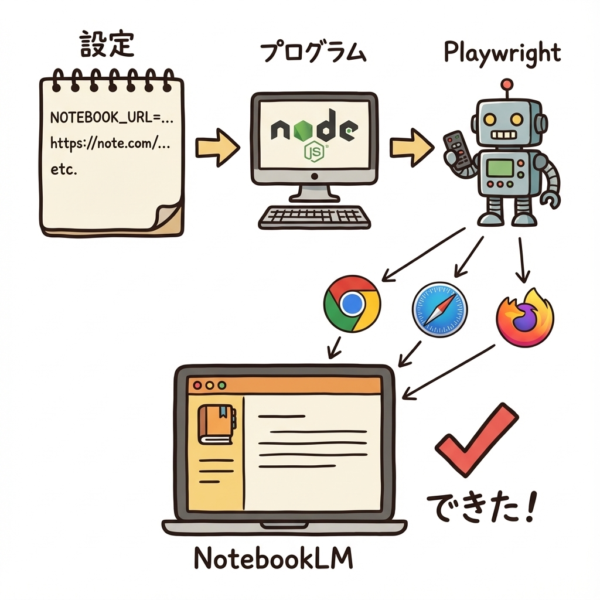

# NotebookLM URL Auto-Add

NotebookLMにWebサイトURLを自動的に追加・同期するツールです。1つの設定ファイルで複数のノートブック（プロジェクト）を管理できます。

## アーキテクチャ



## 主な機能

- **複数ノートブック対応**: 複数のNotebookLMプロジェクトを1度の実行でまとめて更新
- **マルチタブ処理**: ノートブックごとに新しいタブを開いて並列（順次）処理
- **一括追加**: 複数のURLを効率的に一括追加
- **同期（Sync）**: リストにないソースを自動削除し、常に設定と一致させる
- **カスタマイズ**: ブラウザを閉じるまでの時間などを設定可能

## セットアップ

`npm start` を実行すると自動的に必要なパッケージがインストールされます。

### 1. 設定ファイルの作成

`config.env.example` を `config.env` にコピーして編集してください:

```bash
cp config.env.example config.env
```

`config.env` の記述例:

```env
# ブラウザを自動で閉じるまでの待機時間（秒）
CLOSE_WAIT_SEC=30

# ノートブック 1
NOTEBOOK_URL=https://notebooklm.google.com/notebook/notebook-id-1
SYNC_MODE=true
https://note.com/page1
https://note.com/page2

# ノートブック 2
NOTEBOOK_URL=https://notebooklm.google.com/notebook/notebook-id-2
SYNC_MODE=true
https://arxiv.org/pdf/2510.11438
```

## 使い方

プロジェクトのルートディレクトリで以下のコマンドを実行してください:

```bash
# 実行（依存パッケージも自動インストールされます）
npm start
```

### 自作コマンドとして登録する場合

一度だけ以下のコマンドを実行すると、システムに `notebook-auto` コマンドが登録され、どのディレクトリからでも実行可能になります。

```bash
# パッケージをリンク
npm link

# 以降はこれだけで実行可能
notebook-auto
```

### 補足
- 本ツールはシステムにインストール済みの **Google Chrome** を使用します。
- 最初のノートブック実行時にログイン待機が発生します。一度ログインすればセッションが保存されます。

## ファイル構成

```
notebook-auto/
├── index.js              # メインスクリプト
├── package.json
├── config.env            # 設定ファイル（要作成、Git管理外）
├── config.env.example    # 設定ファイルのサンプル
├── architecture.jpeg     # アーキテクチャ図
├── .gitignore            # Git除外設定
├── note/                 # メモ・画像フォルダ（Git管理外）
└── playwright-session/   # セッション保持用（自動生成）
```

## 技術スタック

- Node.js
- Playwright（ブラウザ自動化 / システムのChromeを制御）
